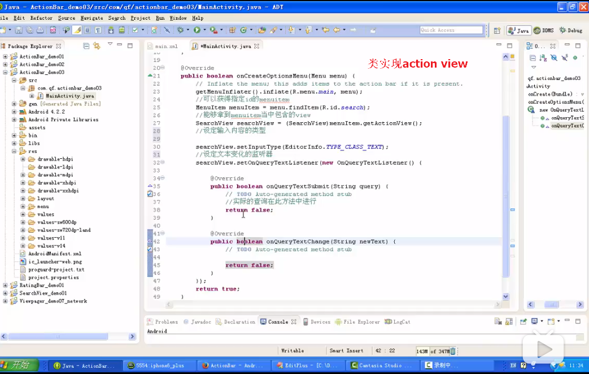
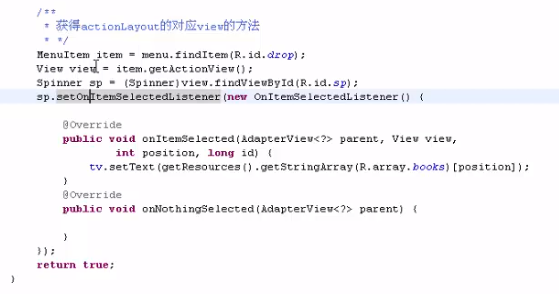

# Android基础知识学习

## 一、Android当中数据存储的方式

1. ShardPreference   共享参数
2. File存储：内部存储，外部存储（SDCard存储）
3. SQLLite数据库存储
4. Content Proivder    内容提供者
5. 网络存储

### 1. ShardPreference   共享参数

#### 特征

1. 存放轻量级数据的存储方式。
2. 本质是存储为xml文件形式，然后通过读取键值对的形式对数据进行操作。
3. 通常是用于存储一些简单的配置信息。

#### 用法

**存储**

1. getSharedPreferences(String name,int mode)方法   //针对context

| parameters ： |                  |
| :-----------: | :--------------: |
|     name      | 所存配置文件名称 |
|     mode      |       权限       |

mode：

MODE_PRIVATE                        ：只能被本程序读写

Mode_WORLD_READABLE      ：已生成的xml文件可以在其他程序中可读

MODE_WORLD_WRITEABLE    ： 已生成的xml文件可以在其他程序中可写

MODE_MULTI_PROCESS          ： 更改数据时提醒的进程

2. 存放数据的方法用SharedPreferences.Editor


**读取**

ShardPreference方法：


#### 例子

**通过共享参数来存数据步骤：**

1. 获得SharedPreference的对象，getSharedPreferences(String ,int )；
2. 获取Editor的对象，通过SharedPreference.edit()方法
3. 调用Editor对象的putxxx(key,value)的方法，来存放数据。
4. 调用editor.commit()方法，提交添加或修改的内容。


**共享参数取出数据的步骤：**

1. 获得SharedPreference的对象，getSharedPreferences(String ,int )；
2. 调用SharedPreference的对象中的getxxx()方法，传入相应的key值，就能获取到数据了。


#### 总结

**使用共享参数存放数据的位置：**

data/data/<你的包名>/shared_prefs/...

***

editor.clear()           ：清空所有的数据内容

editor.remove(key)：移除指定键值的数据

***

sharedpreferences.contains(key)：判断数据中是否包含此键值。

***

getSharedPreferences(String ,int )；

name：生成的xml文件的名称

mode：生成文件的权限

MODE_PRIVATE、MODE_PRIVATE、MODE_WORLD_WRITEABLE、MODE_MULTI_PROCESS（如**用法**所示）

## 二、ActionBar的使用方法

* ActionBar：使用活动条

* Android3.0的重要更新。主要显示再屏幕的顶端，一般用于显示图标和应用名。

* 功能：

  1. 可以显示选项菜单的菜单项。把menu item转化为action item：在布局文件中的item控件中添加android:showAsAction="always|withText"

     此操作可将选项菜单固定放到actionbar之上

  2. 使用应用程序的图标可以进行相关操作

  3. 提供了交互式的view，作为action view

  4. 提供了tab导航方式，可以随意切换多个fragment。

  5. 提供了下拉列表的方式

  6. ActionProvider的使用，在actionbar上加入了popuwindow

```java
/*功能一：选项菜单菜单项显示在ActionBar上。
actionbar上显示选项菜单的菜单项，通过调用menuitem的setShowAsAction的方法
showAsAction属性包含的参数：
SHOW_AS_ACTION_ALWAYS：menuitem总是在actionbar上显示。
SHOW_AS_ACTION_IF_ROOM：当actionbar的位置足够时，才显示menuitem
SHOW_AS_ACTION_NEVER：不将该menuitem显示在actionbar上。
SHOW_AS_ACTION_WITH_TEXT：将menuitem显示在菜单项上，并显示该菜单的文本内容。
*/

/*功能二：关于应用程序图标的使用*/
setDisplayHomeAsUpEnabled(boolean showHomeAsUp);    //设置应用程序的图标变成可点击的图标，并且在图标的左边加入一个箭头

setDisplayOptions(int options);      //通过传递的int类型，来确定actionbar显示选项。

setDisplayShowHomeEnabled(boolean showHome);     //设置是否要显示应用程序的图标

setHomeButtonEnabled(boolean enabled);     //将应用程序的图标转变为可点击的按钮

/*❤❤*/
SearchView    //搜索框控件
setIconifiedByDefault(boolean)；    //设置搜索框是否自动缩小为图标
setQueryHint(CharSequence);      //设置搜索框内默认显示的提示文本
setSubmitButtonEnabled(true);   //设置是否显示提交的按钮
SearchView.OnQueryTextListener;   //监听搜索框内容的事件监听器

/*ListView的过滤器：*/
lv.setTextFilterEnabled(true);  //设置ListView是否具有过滤的功能
lv.clearTextFilter();     //清除过滤
lv.setFilterText(newText);    //对指定的内容进行过滤

/*RatingBar：通过星星来表示进度
android:inIndicator:
android:numStars    设置星级评分有几颗星
android:rating      设置星级评分默认的星级
android:stepSize    设置每次最少改变多少星级

RatingBar.OnRatingBarChangeListener    监听器，当星级评分发生改变时，就调用其方法。
*/

/*功能三：可提供view也可提供布局
ActionBar上除了可以显示普通的action item之外，还可以显示普通的ui组件。
在ActionBar上添加action view，有两种方式：
1. 定义action item，用android:actionViewClass属性指定action view的实现类。*/
```



```java
/*2. 定义action item，用android:actionLayout属性指定action view对应视图资源。
*/
```



```java
/*功能四：提供tab导航
1. 调用ActionBar的 getNavigationMode(int mode)，设置actionbar使用标签导航形式。
2. 调用ActionBar的addTab()的方法，添加多个tab标签
mode包含的几种形式：
NAVIGATION_MODE_STANDARD    ：标准的，默认的
NAVIGATION_MODE_LIST        ：下拉列表形式
NAVIGATION_MODE_TABS        ：tab标签导航栏
*/
```


```java
/*功能五：提供了下拉列表的方式

*/
```


* ActionBar的作用

  1. 提供服用户当前位置的指示：actionbar中的标题以及图标
  2. 提供用于操作Activity的重要动作：action
  3. 提供不同的导航：tabs   drop-drown    lists

* 如何去获取actionbar的实例：

  getActionBar();

* 去除actionbar的方法：
  1. requestWindowFeature(getWindow().FEATURE_NO_TITLE);   //去除标题栏
  2. 在清单文件中的，添加android:theme="@android:style/Theme.Holo.NoActionBar"或者是android:theme="@android:style/Theme.Light.NoTitleBar"

* actionbar的显示和隐藏：

  通过调用actionbar.hide()和actionbar.show()方法来实现。