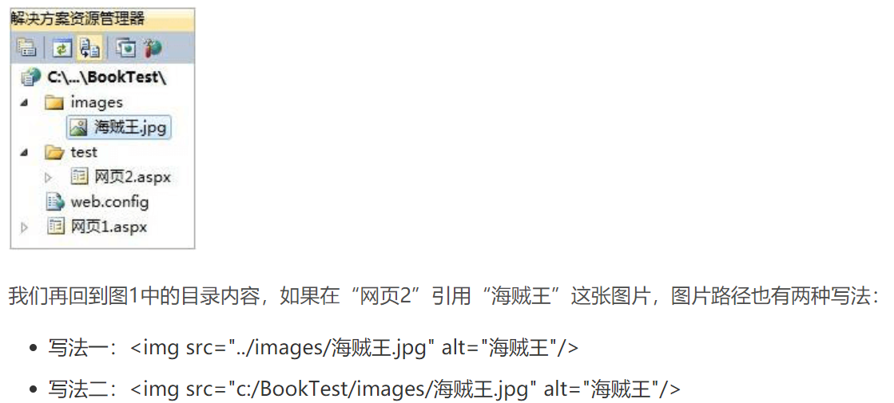

# Qutu项目总录

## 数据库建表

1. users.Table（用户信息表）

   |   字段名   |   数据类型   | 主键 |
   | :--------: | :----------: | :--: |
   |     id     |     INT      |  √   |
   |  username  |   CHAR(30)   |      |
   |  password  |   CHAR(61)   |      |
   |   gender   |   TINYINT    |      |
   | birthdate  |     DATE     |      |
   |    addr    | VARCHAR(250) |      |
   | avatar_uri | VARCHAR(250) |      |
   |   scope    |   TINYINT    |      |
   |  created   |  TIMESTAMP   |      |
   |  updated   |  TIMESTAMP   |      |
   
2. collection.Table（个人收藏表）

   |  字段名   |   数据类型    | 主键 |
   | :-------: | :-----------: | :--: |
   |    id     |      INT      |  √   |
   |  user_id  |      INT      |      |
   |  tag_id   |      INT      |      |
   |  chinese  | VARCHAR(2500) |      |
   |  english  |   CHAR(100)   |      |
   | image_uri |   CHAR(100)   |      |
   |   count   |      INT      |      |
   |  created  |   TIMESTAMP   |      |
   |  updated  |   TIMESTAMP   |      |

3. tags.Table（兴趣分类表）

   | 字段名  | 数据类型  | 主键 |
   | :-----: | :-------: | :--: |
   |   id    |    INT    |  √   |
   |  type   | CHAR(30)  |      |
   | created | TIMESTAMP |      |
   | updated | TIMESTAMP |      |
   
4. search_records.Table（扫描记录表）

   |  字段名   |   数据类型   | 主键 |
   | :-------: | :----------: | :--: |
   |    id     |     INT      |  √   |
   |  user_id  |     INT      |      |
   |  tag_id   |     INT      |      |
   |  english  |  CHAR(100)   |      |
   |  chinese  | VARCHAR(250) |      |
   | image_uri | VARCHAR(250) |      |
   |  created  |  TIMESTAMP   |      |
   |  updated  |  TIMESTAMP   |      |

5. shares.Table（分享表）

   |  字段名   | 数据类型  | 主键 |
   | :-------: | :-------: | :--: |
   |    id     |    INT    |  √   |
   | record_id |    INT    |      |
   |  user_id  |    INT    |      |
   |  created  | TIMESTAMP |      |
   |  updated  | TIMESTAMP |      |

6. study_records.Table（学习记录表）

   |    字段名     | 数据类型  | 主键 |
   | :-----------: | :-------: | :--: |
   |      id       |    INT    |  √   |
   | collection_id |    INT    |      |
   |    created    | TIMESTAMP |      |
   |    updated    | TIMESTAMP |      |

## APP前端布局知识

1.[控件介绍](https://blog.csdn.net/qq_38487155/article/details/81011301)

[当Fragment遇上ViewPager](https://www.jianshu.com/p/6e7f894014b8)

[Fragment不为人知的细节](https://www.jianshu.com/p/3d27ddc952fe)

[ImageView控件的scaleType属性](https://blog.csdn.net/u012702547/article/details/50586946/)

2.布局

距离属性

①padding：容器内部距离

②margin：本容器相对其他容器之间的距离

③layout_below：在某元素下方

[android:layout_alignParent 布局相对于父布局的位置](https://blog.csdn.net/chailongger/article/details/82217547)

[Android界面设计使用卡片化布局的标准和规范](https://www.25xt.com/appdesign/13221.html)

[单词卡片1](https://github.com/kikoso/Swipeable-Cards)

[单词卡片2](https://blog.csdn.net/u014620028/article/details/100098090)

3.activity生命周期

finish();   //销毁当前activity

4.sqlite

Device File Explorer—>data—>data—>（找与app项目模式下java文件夹下的文件夹名称相同的文件）—>database

[【Android】AndroidStudio3.0+保存并查看SQLite数据库文件](https://blog.csdn.net/midnight_time/article/details/80964647)

## 后端开发知识

### 一、Java语法

```java
public class Resp<T> {                                                 //泛型类；
    private Integer code;
    private List<String> messages = new ArrayList<>();
    private T data;

    public void setCode(Integer code){
        this.code = code;
    }
    public Integer getCode(){
        return this.code;
    }
    public void setData(T data){
        this.data = data;
    }
    public T getData(){
        return this.data;
    }

    public List<String> getMessages() {
        return messages;
    }

    public void setMessages(List<String> messages) {
        this.messages = messages;
    }

    public Resp(Integer code, String message, T data) {
        this.code = code;
        this.messages.add(message);
        this.data = data;
    }

    public Resp(T data) {
        this(2000, "操作成功", data);
    }
    public Resp(String message, T data) {
        this(2000, message, data);
    }
    public Resp() {
    }

    public void addMessage(String message) {
        this.messages.add(message);
    }
}
```


### 二、维持APP用户登录状态


Token运行机制：

[1. 登录验证](https://blog.csdn.net/weixin_43495390/article/details/89278834)

## 进度阶段总结汇报

### 2020.02.07

**已完成：**

1. 基础环境已经搭建好，规范和公共模块制定开发完成
2. 部分静态页面已完成
3. 数据库设计完成

**正在进行：**

1. 学习Android前端布局和springboot后端开发
2. 客户端数据请求公共模块的开发，学习具体业务的写法

### 2020.02.19

**已完成：**

1. 基础界面设计完毕
2. 登录注册业务接口代码实现（使用springboot）

**正在进行中：**

1. 界面精化，非主要功能界面设计
2. 找英语词典API

### 2020.03.06

**已完成：**

1、文章推送逻辑代码

2、单词搜索逻辑代码

3、信息修改逻辑代码（用户头像点击进入）

由于此APP采用前后端分离，springboot后端技术，尚未部署到公网上，故未在局域网中的运行的apk无法与后端交互，所以代码里面注释了

### 2020.03.21

**已完成：**

特色功能：
通过拍照得到物体图片，然后进行图像识别分类，且将识别所得文字翻译为对应的英文单词，同时将图片进行卡通化处理，制作成一张由中文、英文和图片构成的单词卡片；

**未完成**：

图像卡通化已找到相应代码，还在试验阶段

### 2020.03.30

**未完成：**

1、前端接收后端数据还有点问题，在调试。

### 2020.04.27

**优化方案：**

1. 注册功能优化：

   ①加入向下点击按钮进入详细信息输入 √

   ②可以简单注册（即仅注册用户名+密码）√

2. 单词学习部分：
   ①拼写功能（拼写正确，言语奖励；错误，言语鼓励）√

   ②设置等级（拼写单词达到一定的正确量可以升级，等级所对应名称在统计界面显示）×

3. 学习统计界面优化：

   ①设置头像 ×

   ②显示等级名称 ×

   ③界面布局再想想方案 √

4. 总体界面颜色规范化（单词卡片界面/收藏界面/统计界面/社区界面）：以**蓝色**为主色调

5. 点击用户界面的头像可以修改头像

**问题：**

1. 登录界面——输错用户名和密码会闪退
2. 单词循环界面是否加入适配器的每次只加一个单词 √
3. sum：统计部分五月份的学习记录和搜索记录后端查询为空
4. collection：当收藏夹为空，会报错

## 项目小注：

1. **一个合格项目所具备的要素**

   [点这里](https://blog.csdn.net/ouxiang08/article/details/88625545)

2. 相对路径：./name/dudu.jpg(同级目录)

../name/dudu.jpg(上一级目录)



3. ```java
   System.out.println();   //快捷键：输入sout
   ```

## 论文大纲

1 项目概述

1.1 引言

1.2 现状分析

1.3 设计目的

1.4 用户分析

1.5 设计思路

2 功能设计

3 技术概述

4 数据库设计

5 详细设计

6 总结

## 待解决问题总汇：

管理端：

用户管理如何搜索的数据库？